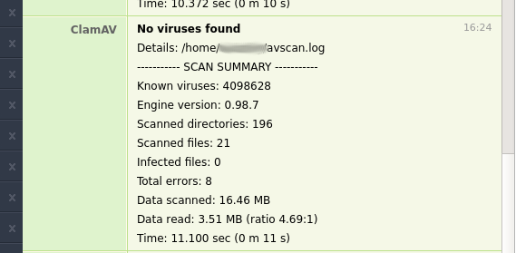

# Clam AV ruby wrapper with HipChat notifications

Scans your server using ClamAV and sends HipChat notifications with summary.

Run scanner:
```
AVSCAN_LOG_FILE=/home/user/avscan.log AVSCAN_PATH=/ AVSCAN_HIPCHAT_ROOM_ID=your-room-id AVSCAN_HIPCHAT_ROOM_TOKEN=your-notification-token ruby avscan.rb
```

Example ouput:



Feel free to fork and adjust it to your needs.
